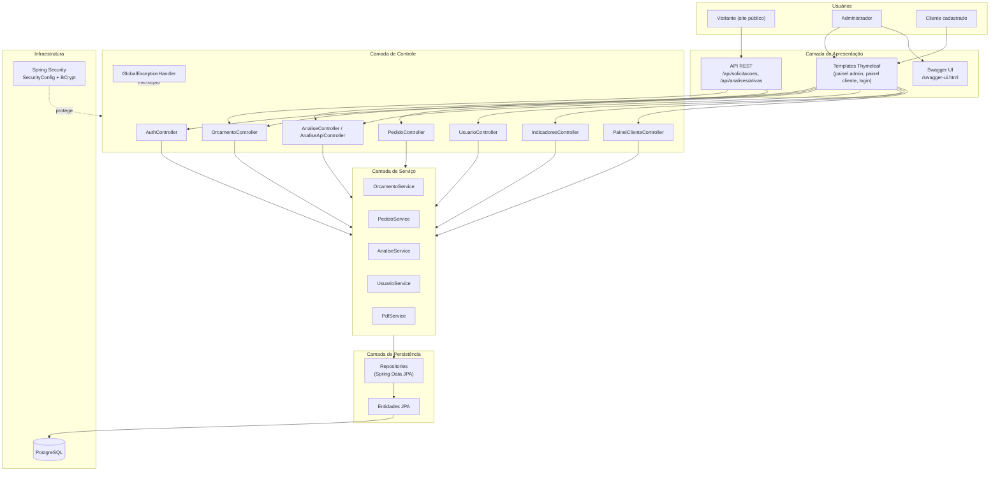
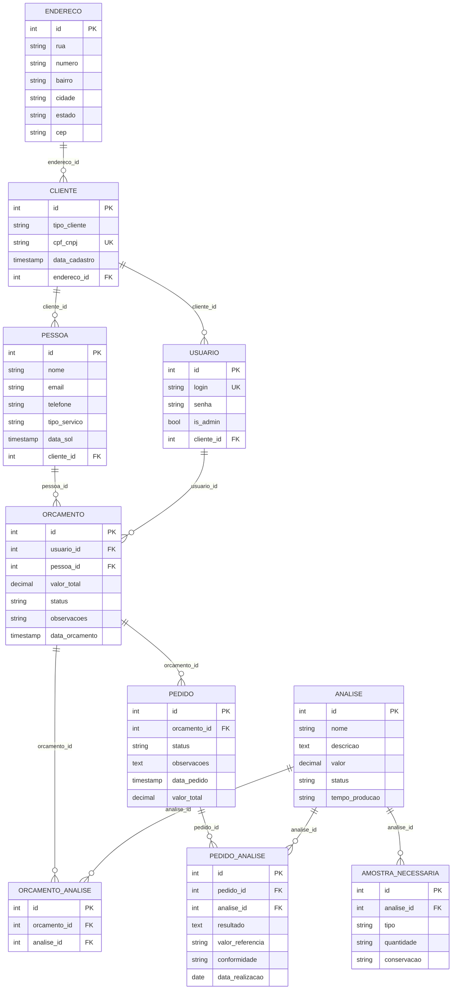
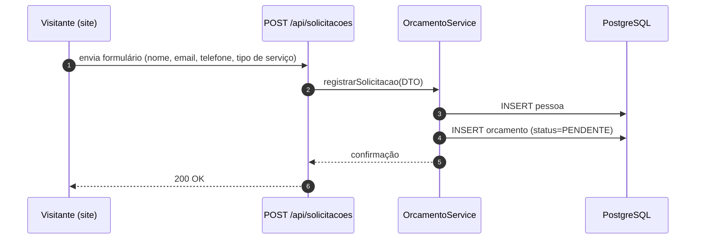
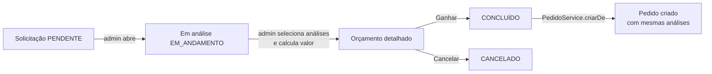
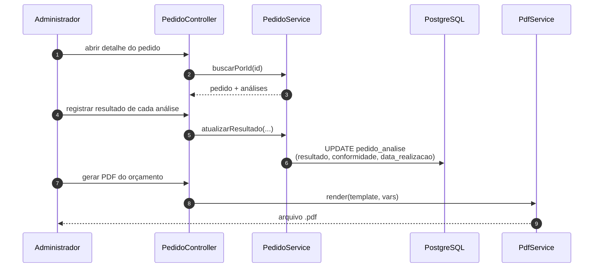
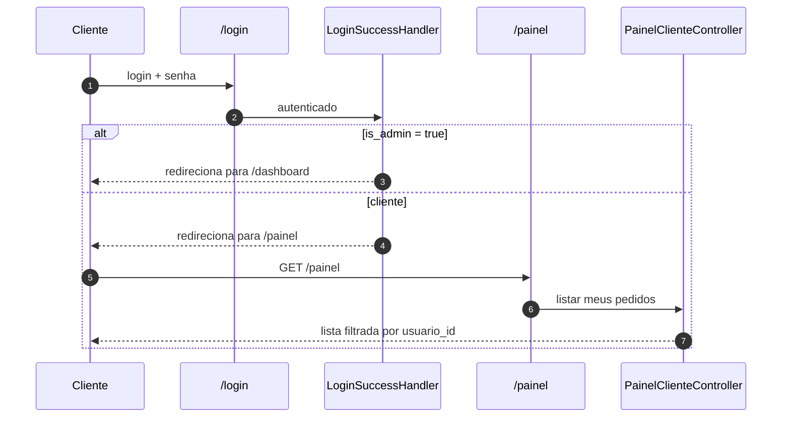

# Projeto Microbio — Relatório Geral

**Sistema de Gestão de Orçamentos e Análises Microbiológicas**

---

| Campo | Conteúdo |
|---|---|
| Disciplina | Projeto Integrador |
| Curso | _(preencher)_ |
| Instituição | _(preencher)_ |
| Autor(es) | Breno Antonioli _(e demais integrantes do grupo)_ |
| Cliente | Microbio (laboratório de análises microbiológicas) |
| Repositório | `microbio` |
| Branch principal | `main` |
| Versão da aplicação | `0.0.1-SNAPSHOT` |
| Data do relatório | 10 de junho de 2026 |

---

## 1. Resumo Executivo

O **Microbio** é uma aplicação web desenvolvida em **Java 21** com **Spring Boot 4.0.6**, voltada à digitalização do fluxo de trabalho de um laboratório de análises microbiológicas. O sistema centraliza o ciclo completo que vai desde o recebimento de uma solicitação de orçamento, passando pela aprovação comercial, conversão em pedido de execução, registro de resultados laboratoriais e disponibilização de painel para o cliente acompanhar o andamento de seus pedidos.

O produto entrega três frentes principais: um **canal público** de recepção de solicitações (formulário institucional integrado via API REST), um **painel administrativo completo** para a equipe interna gerenciar orçamentos, pedidos, catálogo de análises e usuários, e um **painel do cliente** com visualização restrita aos seus próprios pedidos. Toda a API REST é documentada via Swagger/OpenAPI, e o sistema possui geração nativa de relatórios em PDF.

---

## 2. Contexto e Justificativa

A empresa **Microbio** atua na prestação de serviços laboratoriais de análise microbiológica. Antes do projeto, o fluxo de atendimento ao cliente era essencialmente manual: pedidos chegavam por canais não padronizados (telefone, e-mail, mensagens), os orçamentos eram elaborados em planilhas isoladas, e o acompanhamento de cada pedido dependia de comunicação informal entre equipe e cliente.

Esse cenário trazia três dores recorrentes:

1. **Recepção desorganizada** — sem um ponto único de entrada, solicitações se perdiam ou demoravam a ser respondidas.
2. **Falta de rastreabilidade** — não existia histórico estruturado de status do orçamento (pendente, em andamento, concluído, cancelado) nem do pedido decorrente.
3. **Catálogo de análises descentralizado** — informações sobre cada análise (valor, tempo de produção, amostras necessárias, conservação) ficavam dispersas, o que dificultava a montagem de orçamentos consistentes.

O objetivo do Projeto Integrador foi, portanto, **substituir esse fluxo manual por um sistema web único**, capaz de receber solicitações via formulário, organizar o catálogo de análises, conduzir o ciclo de vida do orçamento e do pedido, e oferecer transparência ao cliente final por meio de um painel próprio.

---

## 3. Escopo do Sistema

### 3.1. Dentro do escopo (entregue)

- **Recepção pública de solicitações** via `POST /api/solicitacoes` (formulário institucional).
- **Catálogo de análises** com nome, descrição, valor, tempo de produção e amostras necessárias (tipo, quantidade, conservação).
- **Fluxo de orçamento** com workflow de status (`PENDENTE → EM_ANDAMENTO → CONCLUÍDO | CANCELADO`).
- **Conversão automática** de orçamento ganho em pedido de execução.
- **Registro de resultados** das análises do pedido, com flag de conformidade.
- **Geração de PDF** de orçamentos (Flying Saucer + OpenPDF).
- **Autenticação por papel** com Spring Security (`ROLE_ADMIN`, `ROLE_USER`) e BCrypt.
- **Painel administrativo** com dashboard de indicadores (contagens por status, gráfico dos últimos 6 meses).
- **Painel do cliente** com visualização restrita aos próprios pedidos.
- **Documentação da API** via Swagger/OpenAPI (SpringDoc).

### 3.2. Fora do escopo (atual)

- Notificações por e-mail / SMS / WhatsApp.
- Integração com gateway de pagamento.
- Aplicativo mobile nativo.
- Assinatura digital dos laudos.
- Integração com equipamentos de laboratório.

---

## 4. Tecnologias Utilizadas

| Camada | Tecnologia | Versão | Por que foi escolhida |
|---|---|---|---|
| Linguagem | Java | 21 (LTS) | LTS atual, recursos modernos (records, pattern matching) e alinhamento com Spring Boot 4.x. |
| Framework principal | Spring Boot | 4.0.6 | Padrão de mercado para aplicações web Java; ecosistema robusto. |
| Segurança | Spring Security | 6 (via Boot) | Autenticação/autorização declarativa, integração nativa com BCrypt. |
| Persistência | Spring Data JPA + Hibernate | via Boot | Reduz boilerplate de DAO; mapeamento objeto-relacional consolidado. |
| Banco de dados | PostgreSQL | — | Banco relacional open-source maduro, com bom suporte a tipos e índices. |
| Frontend | Thymeleaf + HTML/CSS/JS | via Boot | Renderização server-side simples, integrada ao Spring; menor complexidade para o escopo. |
| Documentação API | SpringDoc OpenAPI (Swagger UI) | 3.0.0 | Geração automática de docs a partir das anotações dos controllers. |
| Geração de PDF | Flying Saucer + OpenPDF | 9.4.0 | Permite reaproveitar templates Thymeleaf para gerar PDFs de orçamentos. |
| Validação | Bean Validation (Jakarta) | via starter-validation | `@NotBlank`, `@Email`, `@Size` em DTOs de entrada. |
| Produtividade | Lombok | via starter | Elimina boilerplate de getters/setters/builders. |
| Build | Maven Wrapper (`mvnw`) | 3.9.x | Garante a mesma versão do Maven para todos os desenvolvedores. |
| Versionamento | Git (modelo Git Flow) | — | Branches `main`, `swagger`, *feature*, e merges via Pull Request. |

> Fonte: `pom.xml` e `application.properties`.

---

## 5. Arquitetura

A aplicação segue a arquitetura em camadas típica do Spring Boot, com clara separação entre apresentação, lógica de negócio e persistência.

### 5.1. Visão em camadas



### 5.2. Responsabilidades de cada camada

- **Apresentação**
  - **Thymeleaf** renderiza as telas administrativas (`templates/painel`, `templates/orcamentos`, `templates/pedidos`, `templates/analises`, `templates/indicadores`) e o painel do cliente (`templates/painel`).
  - A **API REST pública** expõe dois endpoints: `POST /api/solicitacoes` (recepção de solicitações vindas do site institucional) e `GET /api/analises/ativas` (alimenta o `<select>` do formulário).
  - O **Swagger UI** documenta a API e fica restrito a administradores.

- **Controle (`controller/`)**
  - 16 controllers organizados por contexto funcional. Destaque para `OrcamentoController`, `PedidoController`, `IndicadoresController` e `PainelClienteController`.
  - Tratamento centralizado de exceções via `GlobalExceptionHandler`.

- **Serviço (`service/`)**
  - Concentra a lógica de negócio. Os mais relevantes são `OrcamentoService` (workflow de status, criação a partir de solicitação), `PedidoService` (conversão de orçamento em pedido, registro de resultados) e `AnaliseService` (CRUD com amostras necessárias).
  - `PdfService` encapsula a geração de PDFs reaproveitando templates Thymeleaf renderizados por Flying Saucer.

- **Persistência (`repository/` + `model/`)**
  - Interfaces `Spring Data JPA` para cada entidade, com queries derivadas do nome do método.
  - 11 entidades JPA mapeando o domínio.

- **Segurança (`security/`)**
  - `SecurityConfig` define endpoints públicos vs. protegidos, BCrypt para hash de senha, e configuração de form-login.
  - `CustomUserDetailsService` carrega o usuário do banco.
  - `LoginSuccessHandler` decide o destino pós-login: admin → `/dashboard`, cliente → `/painel`.

### 5.3. Decisões arquiteturais relevantes

- **Frontend server-side (Thymeleaf)** em vez de SPA (React/Angular): reduz complexidade operacional, dispensa duplo deploy e é suficiente para o escopo interno do laboratório.
- **API REST coexistindo com MVC**: permite que o site institucional consuma a API sem autenticação para receber solicitações, ao mesmo tempo em que a administração ocorre por sessão tradicional.
- **CSRF desativado apenas em `/api/**`**: mantém a proteção nas telas internas e libera consumo externo controlado.

---

## 6. Modelo de Dados

### 6.1. Diagrama Entidade-Relacionamento



### 6.2. Descrição das entidades

| Entidade | Papel no domínio |
|---|---|
| `Endereco` | Endereço físico (1:1 opcional com `Cliente`). |
| `Cliente` | Pessoa física ou jurídica cadastrada formalmente, identificada por CPF/CNPJ. |
| `Usuario` | Credencial de acesso ao sistema; `is_admin` decide qual painel será apresentado. |
| `Pessoa` | Contato inicial vindo da solicitação pública — ainda não é necessariamente um Cliente. |
| `Orcamento` | Proposta comercial gerada a partir de uma `Pessoa`; passa por estados de status até ser ganha ou cancelada. |
| `OrcamentoAnalise` | Tabela de junção entre `Orcamento` e `Analise` (quais análises estão no orçamento). |
| `Analise` | Item do catálogo: nome, valor, tempo de produção e status (ATIVA/INATIVA). |
| `AmostraNecessaria` | Requisitos de amostra para realizar a análise (tipo, quantidade, conservação). |
| `Pedido` | Execução efetiva, criada a partir de um orçamento ganho. |
| `PedidoAnalise` | Junção entre `Pedido` e `Analise`, acrescida de campos laboratoriais: resultado, valor de referência, conformidade e data de realização. |

> Fonte: `schema.sql` e classes em `src/main/java/com/arthurberwanger/microbio/model/`.

---

## 7. Fluxos Funcionais Principais

### 7.1. Recepção pública de uma solicitação



### 7.2. Atendimento administrativo e conversão em pedido



### 7.3. Execução do pedido e registro de resultados



### 7.4. Acesso do cliente ao seu painel



---

## 8. Funcionalidades Implementadas (checklist)

### Segurança e acesso
- [x] Autenticação por login/senha com BCrypt.
- [x] Dois papéis (`ROLE_ADMIN`, `ROLE_USER`) com redirecionamento pós-login distinto.
- [x] Endpoints públicos restritos ao essencial (formulário e assets).
- [x] CSRF habilitado para área administrativa.

### Catálogo de análises
- [x] CRUD completo de análises (criar, listar, atualizar, excluir, ativar/inativar).
- [x] Cadastro de amostras necessárias por análise.
- [x] Filtro por status (ATIVA/INATIVA).
- [x] API pública `GET /api/analises/ativas` para uso no site.

### Orçamentos
- [x] Recepção via API pública (`POST /api/solicitacoes`).
- [x] Workflow de status (`PENDENTE → EM_ANDAMENTO → CONCLUÍDO | CANCELADO`).
- [x] Cálculo de valor total a partir das análises selecionadas.
- [x] Geração de PDF do orçamento.
- [x] Promoção/cancelamento de status com feedback ao usuário.

### Pedidos
- [x] Criação automática a partir de orçamento ganho.
- [x] Adição/remoção de análises no pedido.
- [x] Registro de resultados, valor de referência e conformidade.
- [x] Visualização detalhada por administrador.

### Painel administrativo
- [x] Dashboard com contagens (orçamentos, pedidos, usuários).
- [x] Gráfico de orçamentos dos últimos 6 meses.
- [x] CRUD de usuários (modo simples e modo completo com Cliente + Endereço).

### Painel do cliente
- [x] Lista filtrada por `usuario_id`.
- [x] Acesso restrito apenas ao próprio cliente (mesmo logado, não vê dados de outros).

### Documentação
- [x] Swagger UI em `/swagger-ui.html` (restrito a admin).
- [x] Anotações `@Tag` e `@Operation` nos endpoints REST.

---

## 9. Pontos de Destaque

São aspectos do projeto que merecem reconhecimento técnico e didático:

1. **Arquitetura limpa em camadas.** A separação `controller / service / repository / model` é respeitada de forma consistente em todos os módulos. Não há lógica de negócio em controllers nem acesso direto a repositórios fora dos serviços.

2. **Spring Security configurado de forma idiomática.** O `SecurityConfig` declara explicitamente cada matcher por papel, usa BCrypt como `PasswordEncoder` e delega o redirecionamento pós-login a um `LoginSuccessHandler` próprio — solução elegante para diferenciar admin de cliente.

3. **Conversão automática orçamento → pedido.** A regra de negócio crítica do laboratório (transformar um orçamento ganho em pedido de execução, copiando as análises) está encapsulada em `PedidoService.criarDe(orcamentoId)`, em um único ponto, com cálculo correto de valor total.

4. **API documentada com OpenAPI.** O projeto não se limita a expor JSON: documenta cada endpoint com `@Tag` e `@Operation`, o que facilita a integração futura com o site institucional ou outros consumidores.

5. **Reaproveitamento de templates para PDF.** O `PdfService` usa o próprio motor Thymeleaf para gerar HTML e, em seguida, Flying Saucer para converter em PDF — evitando duplicar a definição visual do orçamento.

6. **Tratamento de exceções centralizado.** O `GlobalExceptionHandler` captura erros de validação e exceções de negócio, devolvendo mensagens consistentes via `RedirectAttributes`.

7. **Catálogo rico de análises.** Cada análise traz não apenas valor e tempo de produção, mas também a lista de amostras necessárias (tipo, quantidade, conservação) — o que aproxima o sistema da realidade laboratorial.

8. **Separação clara de áreas.** Há uma divisão didática entre área pública (site), administrativa (`/dashboard`, `/indicadores`, etc.) e área do cliente (`/painel`), cada uma com seus controllers e templates próprios.

---

## 10. Oportunidades de Evolução

Esta seção apresenta **próximos passos** identificados durante a análise, organizados por horizonte de implementação. Tratam-se de oportunidades naturais de evolução para um sistema que já cobre seu núcleo funcional.

### 10.1. Curto prazo (próxima iteração)

- **Versionamento do schema com Flyway ou Liquibase.** Hoje, `spring.jpa.hibernate.ddl-auto=update` mantém o schema sincronizado automaticamente, complementado por um `schema.sql` manual. Migrar para Flyway/Liquibase deixaria cada alteração de banco rastreável e reproduzível entre ambientes.
- **Externalização de credenciais.** O `application.properties` traz hoje as credenciais do PostgreSQL inline. A próxima evolução é movê-las para variáveis de ambiente (`${DB_USER}`, `${DB_PASSWORD}`), facilitando o deploy em produção sem expor segredos no repositório.
- **Logging estruturado.** As mensagens de inicialização usam `System.out.println` em `MicrobioApplication`. Substituir por SLF4J + Logback permitiria controlar níveis de log por ambiente e gerar trilha de auditoria.
- **Profiles `dev` e `prod`.** Criar `application-dev.properties` e `application-prod.properties` para separar `show-sql=true` (útil em desenvolvimento) de `show-sql=false` (produção), além de outras configurações sensíveis a ambiente.

### 10.2. Médio prazo

- **Suíte de testes automatizados.** Atualmente o projeto possui apenas o teste `contextLoads()` gerado por padrão. Oportunidades:
  - Testes unitários para `OrcamentoService`, `PedidoService` e `AnaliseService` (regras de transição de status, cálculo de valor total, conversão orçamento → pedido).
  - Testes de integração com `@SpringBootTest` + banco em container (Testcontainers).
  - Testes de segurança verificando que `/painel` não é acessível a admin e `/dashboard` não é acessível a cliente.
- **Validação consistente nos DTOs.** Ampliar o uso de Bean Validation para garantir mensagens uniformes em todos os endpoints (não só `OrcamentoDTO`).
- **Plugin JaCoCo para cobertura de testes** e plugin OWASP Dependency-Check para auditoria de dependências.
- **Auditoria de mudanças.** Registrar quem alterou o status de um orçamento/pedido e quando (campos `criado_por`, `alterado_por`, `alterado_em`).

### 10.3. Longo prazo / evolução do produto

- **Notificações ao cliente.** E-mail (ou WhatsApp via API) quando um orçamento muda de status ou quando um pedido é concluído.
- **Assinatura digital de laudos.** Integrar a geração de PDF com assinatura digital, dando validade legal ao laudo.
- **Pipeline CI/CD.** GitHub Actions executando build, testes e análise estática a cada Pull Request; Dockerfile + `docker-compose` para padronizar ambientes.
- **Observabilidade.** Spring Boot Actuator + Prometheus + Grafana para métricas de saúde da aplicação e do banco.
- **API REST completa.** Hoje a API expõe apenas os dois endpoints públicos. Expandir para um conjunto completo (CRUD via REST) abriria a porta para um app mobile ou integração com sistemas externos do cliente.
- **Aplicativo mobile (cliente).** Um app simples em que o cliente acompanha pedidos e recebe notificações push.

---

## 11. Como Executar Localmente

### 11.1. Pré-requisitos

- Java 21 instalado (`java -version`).
- PostgreSQL acessível em `localhost:5432` com banco `microbio_db` criado.
- Maven Wrapper já incluso (`./mvnw`).

### 11.2. Passos

```bash
# 1. Configurar o banco
createdb microbio_db
psql -d microbio_db -f schema.sql

# 2. Executar a aplicação
./mvnw spring-boot:run
```

A aplicação ficará disponível em `http://localhost:8080`.

### 11.3. Credenciais iniciais

Na primeira execução, o `CommandLineRunner` em `MicrobioApplication` cria um usuário administrador padrão:

- **Login:** `admin`
- **Senha:** `admin123`

> Recomendação: alterar a senha do `admin` logo após o primeiro acesso.

### 11.4. Endereços úteis

| Recurso | URL |
|---|---|
| Página inicial / login | `http://localhost:8080/` |
| Dashboard administrativo | `http://localhost:8080/dashboard` |
| Painel do cliente | `http://localhost:8080/painel` |
| Swagger UI | `http://localhost:8080/swagger-ui.html` |
| Especificação OpenAPI | `http://localhost:8080/v3/api-docs` |

---

## 12. Estrutura de Pastas (resumo)

```
microbio/
├── pom.xml
├── README.md
├── HELP.md
├── schema.sql
├── mvnw, mvnw.cmd
└── src/main/
    ├── java/com/arthurberwanger/microbio/
    │   ├── MicrobioApplication.java
    │   ├── config/        # OpenApiConfig
    │   ├── controller/    # 16 controllers (web + API)
    │   ├── dto/           # DTOs de entrada
    │   ├── model/         # 11 entidades JPA
    │   ├── repository/    # Spring Data JPA
    │   ├── security/      # SecurityConfig, handlers
    │   └── service/       # Lógica de negócio
    └── resources/
        ├── application.properties
        ├── static/        # CSS, JS, imagens
        └── templates/     # Templates Thymeleaf
            ├── analises/
            ├── auth/
            ├── fragments/
            ├── home/
            ├── indicadores/
            ├── orcamentos/
            ├── painel/
            ├── pdf/
            ├── pedidos/
            ├── solicitacoes/
            └── usuarios/
```

---

## 13. Considerações Finais

O projeto Microbio cumpre o objetivo do Projeto Integrador ao entregar uma solução web completa e funcional para o cliente real (laboratório Microbio). O sistema cobre o fluxo central do negócio — recepção de solicitações, gestão de orçamentos, conversão em pedidos, registro de resultados e disponibilização de painel ao cliente — com arquitetura limpa, autenticação segura e documentação adequada da API.

Do ponto de vista de aprendizado, o desenvolvimento aproximou a equipe de práticas reais do mercado: uso idiomático de Spring Boot, modelagem de domínio com JPA, configuração de Spring Security, integração com bibliotecas externas (OpenPDF, SpringDoc) e versionamento por meio de Git Flow.

As **oportunidades de evolução** listadas na Seção 10 representam o caminho natural para que o sistema evolua de um produto de Projeto Integrador para uma aplicação pronta para operar em produção: testes automatizados, versionamento de schema, observabilidade e notificações são os próximos passos prioritários.

Em resumo, o estado atual do projeto demonstra **domínio dos fundamentos da engenharia de software web em Java** e entrega valor concreto ao cliente, ao mesmo tempo em que deixa caminhos claros para evolução futura.

---

## Apêndice — Conversão para DOCX

O arquivo está em Markdown estendido com diagramas Mermaid. Para gerar um `.docx`:

**Opção 1 — Pandoc (recomendado):**
```bash
# Pré-requisito: instalar mermaid-filter
npm install -g mermaid-filter
pandoc RELATORIO_PROJETO.md \
       -o RELATORIO_PROJETO.docx \
       -F mermaid-filter
```

**Opção 2 — Typora / VS Code:**
- Abrir o `.md` no Typora e usar *File → Export → Word (.docx)*.
- Ou no VS Code com a extensão *Markdown PDF / DOCX Exporter*.

**Opção 3 — Sem suporte a Mermaid:**
- Renderizar os blocos Mermaid em <https://mermaid.live/>, salvar como imagem PNG e substituir os blocos de código por `` antes de converter.

---

*Relatório gerado em 10/06/2026.*
